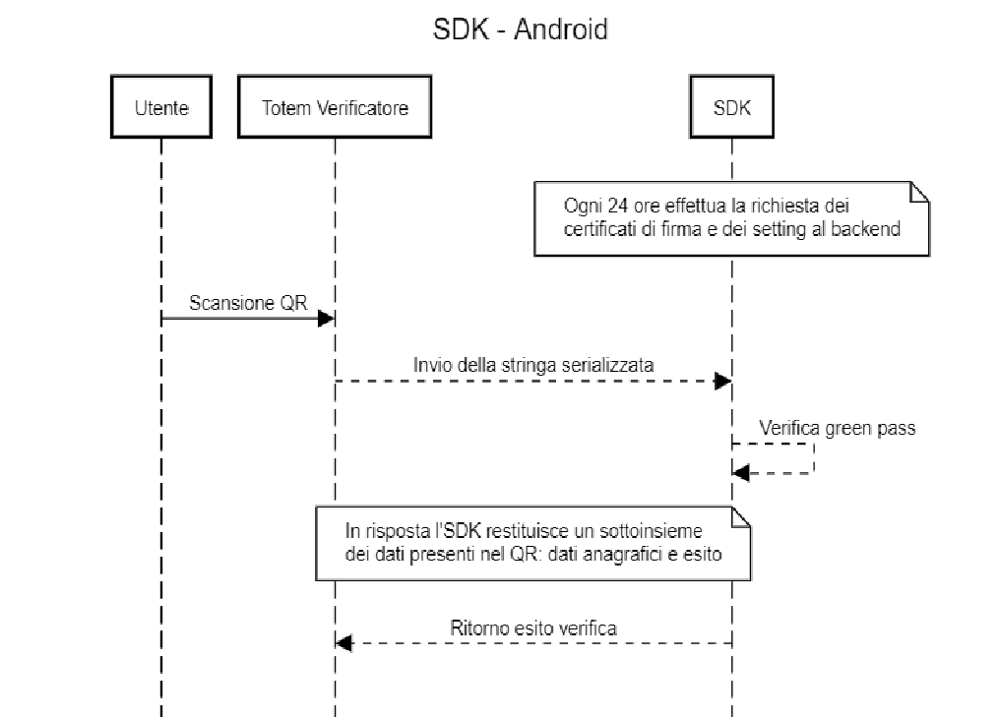

# VerificaC19 SDK Onboarding

## Introduzione
Il presente repository contiene un elenco delle librerie per la validazione 
delle **Certificazioni verdi Covid-19** ( Digital Covid Certificate - DCC), 
anche dette **Green Pass**, aderenti alle specifiche tecniche e ai requisiti 
implementati dal *Ministero della Salute* all’interno dell’applicazione 
governativa **VerificaC19** che, per quanto concerne l’ambiente Android, è rappresentata
all’interno del [repository dedicato](https://github.com/ministero-salute/it-dgc-verificac19-sdk-android).
La procedura di seguito descritta consente l’inserimento nel repository di nuove
librerie/SDK sviluppate in ottemperanza al comma 12 punto a) del 
[DPCM 12 ottobre](https://www.governo.it/sites/governo.it/files/DPCM_12_ottobre.pdf) 
da sottoporre al vaglio del Ministero della Salute. Un esito positivo della 
valutazione si tradurrà nella pubblicazione della URL del repository contenente 
il codice sorgente della libreria/SDK in questione all’interno della [lista](#lista-librerie).

Il canale relativo alle questioni tecniche riguardanti l'implementazione e l'utilizzo degli SDK si trova su [Slack Developers Italia](https://developersitalia.slack.com/archives/C030BJEGEN8).

## Requisiti minimi

1. Tutto il codice sorgente deve essere pubblicato in modalità open source, 
ovvero deve essere reso disponibile all’interno di un repository pubblicamente 
accessibile corredato da una [licenza OSI](https://opensource.org/licenses/alphabetical).
2. Nessuna informazione contenuta nel QR code, né il QR code stesso, deve essere 
memorizzata, immessa in rete o trasmessa/trattata per finalità diverse dalla 
verifica.
3. L’intero processo di verifica deve realizzarsi esclusivamente offline in 
modalità real-time. 
4. Il risultato della verifica non deve essere utilizzato per finalità non 
regolamentate dalle norme vigenti.

## Specifiche tecniche
Si veda come riferimento il [repository dell'SDK ufficiale](https://github.com/ministero-salute/it-dgc-verificac19-sdk-android/blob/develop/README.md) e la [documentazione](https://ministero-salute.github.io/it-dgc-verificac19-sdk-android/documentation/) riguardante la soluzione SDK 
Android.
Inoltre, l’allegato H del DPCM 12 ottobre al punto 2, denominato *VERIFICA
 CERTIFICAZIONE VERDE COVID-19 TRAMITE SDK*, prevede [ulteriori specifiche tecniche](https://www.governo.it/sites/governo.it/files/Dpcm_12_ottobre_ALLEGATO_H.pdf ) 
 e il seguente sequence diagram applicato alla soluzione SDK Android:

### Documenti
- [📄 Documentazione SDK dettagliata](https://ministero-salute.github.io/it-dgc-verificac19-sdk-android/documentation/)
- [📄 Documentazione Digital Green Certificate Revocation List (DRL)](https://github.com/ministero-salute/it-dgc-documentation/blob/master/DRL.md)
- [📄 Documentazione Tipologie di Verifica DGC (ScanMode)](https://github.com/ministero-salute/it-dgc-documentation/blob/master/SCANMODE.md)
- [📄 Digital Green Certificate descrizione ad alto livello](https://github.com/ministero-salute/it-dgc-documentation)

## Lista Librerie

| Nome Soluzione | Tecnologia  | Data Validazione | Verifica GP Rafforzato | Supporto DRL | Verifica Booster | Verifica Esenzioni |
| -----------    | :-: | :-:      |  :-:      |  :-:      |  :-:      |  :-:      | 
| [herald-si/verificac19-sdk-php](https://github.com/herald-si/verificac19-sdk-php)| PHP| 18/11/2021 |  ✅ Da v1.0.5      |  ✅ Da v1.1.0       |  ✅ Da v1.2.0      | ✅ Da v1.3.0      | 
| [ZConnectVerificaC19SDK](https://github.com/hrzucchetti/zconnect-verificaC19-sdk-ios) | IOS native (swift) | 07/12/2021 |  ✅ Da v1.0.4   |  ✅ Da v1.1.0       |  ✅ Da v1.1.1       | ✅ Da v1.1.2      | 
| [DgcReader](https://github.com/DevTrevi/DgcReader) | .NET / .NET Framework | 07/12/2021 | ✅ Da v1.3.0 | ✅ Da v2.0.0 | ✅ Da v2.1.0 | ✅ Da v2.3.0 |
| [verificac19-sdk](https://github.com/italia/verificac19-sdk )   | Node.js |  08/12/2021    |  ✅ Da v0.5.0     |  ✅ Da v0.6.0     | ✅ Da v0.7.0   | ✅ Da v0.8.0 |
| [solari-sviluppo-prodotti/sol-verificaC19-sdk-cpp-linux](https://github.com/solari-sviluppo-prodotti/sol-verificaC19-sdk-cpp-linux)| C++| 10/12/2021 | ✅ Da v1.0.4       |   ✅ Da v1.1.2      |   ✅ Da v1.1.1      | ✅ Da v1.1.3 |
| [hrnext/it-dgc-verificac19-spring](https://github.com/hrnext/it-dgc-verificac19-spring) | Java/Spring | 16/12/2021 | ✅ Da v0.0.2      |  ✅ Da v0.0.3      |  ✅ Da v0.0.3      |  ✅ Da v0.0.4 |

## Inserimento di una libreria nella lista 

Per proporre l’inserimento di una nuova libreria/SDK nella lista è necessario seguire i seguenti passi:

1. Scaricare dal presente repository il documento denominato [autoDichiarazione.odt](autoDichiarazione.odt) e compilarlo.
2. Inviare a **dgsi@postacert.sanita.it** l’autodichiarazione di cui al punto 1 opportunamente compilata e firmata digitalmente. Tale documento *non* dovrà essere incluso nel repository.
3. Pubblicare il codice sorgente della propria soluzione all’interno di un repository di titolarità del richiedente secondo le modalità indicate nel [paragrafo dedicato](#requisiti-minimi).
4. Aprire una [Pull Request](https://github.com/ministero-salute/it-dgc-verificac19-sdk-onboarding/pulls) in questo repository e inserire una nuova riga nella [lista](#lista-librerie) inserendo le informazioni richieste. 

A questo punto inizierà una fase di validazione di quanto sottoposto per verificare l’effettiva rispondenza delle specifiche tecniche e dei requisiti minimi. 
In caso di esito positivo, la Pull Request verrà consolidata entro pochi giorni e apparirà all’interno della [lista](#lista-librerie).
In caso di esito negativo, saranno fornite via email le opportune motivazioni ed eventuali suggerimenti per rendere la libreria aderente ai requisiti minimi.
Eventuali aggiornamenti futuri delle librerie saranno oggetto di successive valutazioni che potrebbero portare alla rimozione della stessa dalla [lista](#lista-librerie) ove non fossero rispettati i requisiti minimi. Per rimanere allineati alle ultime modifiche è possibile consultare il file di [CHANGELOG](CHANGELOG.md).

## Policy di accettazione e eventuale rimozione

Oltre a quanto sopra, il Ministero della Salute avrà facoltà esclusiva di eliminare una proposta dalla [lista](#lista-librerie) nel caso in cui si verifichino una o più delle seguenti condizioni:

* Il repository non contiene sorgenti di software.
* Il repository è ospitato in uno strumento di code hosting non accessibile pubblicamente e gratuitamente.
* Il repository contiene:
    * software incompleto;
    * software non compilabile / installabile;
    * software con evidenti problemi di sicurezza. 
    * software non allineato con i requisiti minimi. 
* Il repository viola regole di diritto, ovvero:
    * software privo di licenza aperta;
    * repository contenente licenze tra loro incompatibili;
    * software che viola diritti di proprietà intellettuale o altri diritti di terzi;
    * repository con contenuti illegali, commerciali o che violano norme di legge;
    * che non permette di capire lo scopo, le finalità e i requisiti del software.

## Risorse esterne 

* [README SDK Android](https://github.com/ministero-salute/it-dgc-verificac19-sdk-android/blob/develop/README.md)
* [Documentazione SDK Android](https://ministero-salute.github.io/it-dgc-verificac19-sdk-android/documentation/)
* [DPCM 12 Ottobre 2021](https://www.governo.it/sites/governo.it/files/DPCM_12_ottobre.pdf)
* [Allegato H DPCM 12 Ottobre 2021](https://www.governo.it/sites/governo.it/files/Dpcm_12_ottobre_ALLEGATO_H.pdf) 

